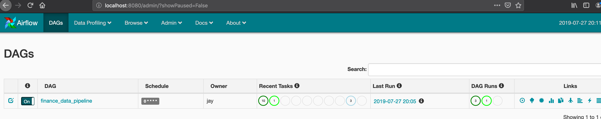
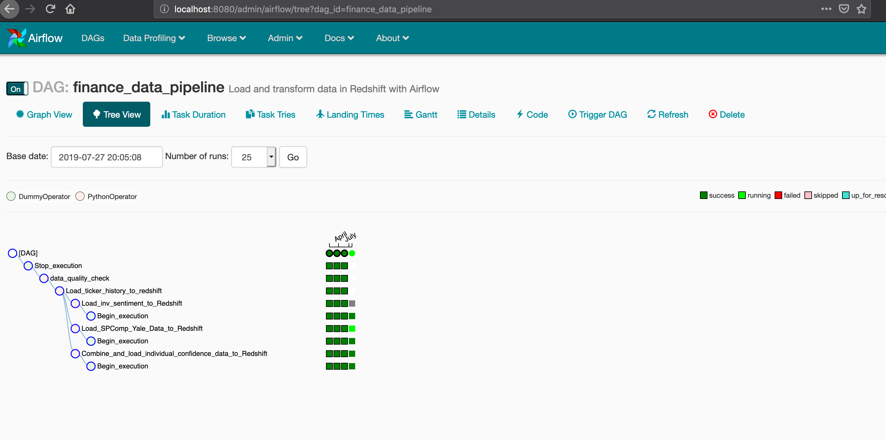
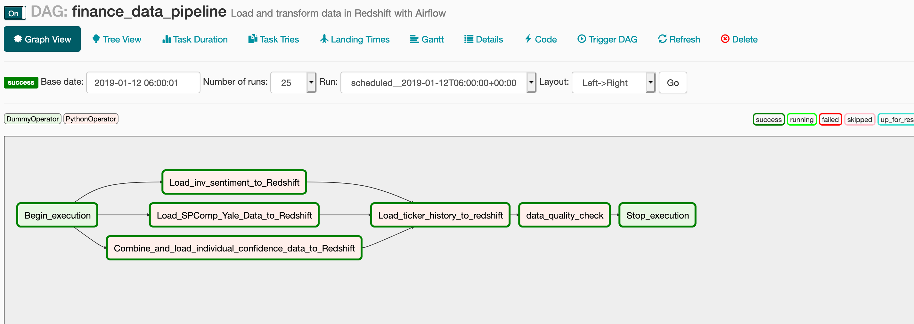

# **US Financial Data Pipeline**

## Scope:
This is an application that services a pipeline to load timeseries US financial data from public API's into a cloud based database (AWS Redshift). The data will be modeled in such away that a user could utilize BI products (Tableau, PowerBI, Superset) in order to analyze this data. The data should allow a user to analyze and compare investor and individual confidence in the Stock Market, how different stocks have behaved over time, and how the S&P 500 has performed over time. 

## Data:
The data is courtesy of AAII, Yale, Quandl, and World Trading Data. The Quandle Open API and the World Trading Data's API were all used to gather data. Due to the limitations and behaviors of these API's, certain compromises needed to be made. For example, it was not possible to get historical data on all 60000+ stocks available under the WTD's API without reducing the number of tickers and dates being queried. What is consistent across all data sets is that each represents monthly data instead of daily or realtime. The data itself is represented below:

#### AAII Investor Sentiment Data (Source: Quandl Free API)
    * Date: Timestamp (Year-Month-Day, Must Have) 
    * Bullish: Double - (nullable) - representation of positive sentiment on stock market.
    * Neutral: Double - (nullable) - representation of neutral sentiment on stock market.
    * Bearish: Double - (nullable) - representation of negative sentiment on stock market.
    * Total: Double - (nullable, should be 1 on non-null rows) - aggregated sentiments.
    * Bullish 8-week Moving Average: Double - (nullable) positive sentiment moving average.
    * Bull-Bear Spread: Double - (nullable) - Absolute value of the difference between bullish and bearish sentiments.
    * Bullish Average: Double - (nullable) - average of bullish sentiments.
    * Bullish Average + Standard Deviation: Double - (nullable) - standard deviation added to buillish average. 
    * Buillish Average - Standard Deviation: Double - (nullable) - standard deviation subtracted from the bullish average. 
    * S&P 500 Weekly High: Double - (nullable) - The S&P 500 weekly high price. 
    * S&P 500 Weekly Low: Double - (nullable) - The S&P 500 weekly low price. 
    * S&P 500 Weekly Close: Double - (nullable) - The S&P 500 weekly closing price. 
    
#### Monthly S&P 500 Composite Data (Source: Yale Department of Economics, Quandl Free API)
    * Date: Timestamp - (Year-Month-Day, non-nullable).
    * S&P Composite: Double - (non-nullable) - Price for S&P 500 Composite.
    * Dividend: Double - (nullable, specifically for most recent months).
    * Earnings: Double - (nullable for most recent months).
    * CPI: Double - (nullable) - Consumer Price Index.
    * Long Interest Rate - (nullable) - Long Interest Rate.
    * Real Price: Double - (non-nullable).
    * Real Dividenc: Double - (nullable).
    * Real Earnings: Double - (nullable).
    * Cyclically Adjusted PE Ratio: Double - (non-nullable).
    
#### US Stock Market Confidence Indices, Individual (Source: Yale Department of Economics, Quandl Free API)
    * Date: Timestamp - (Year-Month-Day, non-nullable).
    * Valuation_Indices: Double - (nullable) - Confidence in Stock Market. 
    * Valuation_indices_Std_Err: Double - (nullable) - Standard error of Confidence Indices.
    * Crash_confidence: Double - (nullable) - Crash Confidence in Stock Market.
    * Crash_confidence_Std_Err: Double - (nullable) - CC standard error.
    * Buy_on_Dips: Double - (nullable) - Confidence to buy during dips.
    * Buy_on_Dips_Std_Err: Double - (nullable) - Standard error of BoD. 
    
#### Historical Single Day Market Data (Source: World Trading Data)
    * Symbol: String - (non-nullable) - Ticker Symbol.
    * Date: Timestamp - (Year-Month-Day, non-nullable).
    * Open: Double - (nullable) - Opening Price.
    * Close: Double - (nullable) - Closing (EOD) Price.
    * High: Double - (nullable) - High price for that day. 
    * low: Double - (nullable) - lowest trading price for that day.
    * volume: Double - (nullable) - number shares that changed hands during the day. 
    
## Tools:
For this task, I chose to use AWS Redshift as my database and Apache Airflow as a tool to develop, manage, and execute my ETL pipeline. 
- Redshift: Redshift is a highly available and highly scalable cloud based database that is one of Amazon's premier data warehousing service. 
- Apache Airflow: A tool used for developing, managing, and scheduling tasks such as those involved in this ETL pipeline. It can be deployed on a local machine, in an AWS Ec2 instance, or on an on premises server. It's plugins feature makes it highly customizable and allows for the use of other tools (such as Apache Spark) for big data pipelining. 

## Images:

    
## Scenarios:
- Data increases by 100X.
    - The beauty of the tools we are using in Airflow and AWS is that they are all scalable. AWS Redshift can scale based on how much you want to spend. If you ever need to scale up, Amazon makes that very easy through saving database snapshots, cloud formation, and friendly pricing. With Airflow, depending on how you write your pipelines, you can keep your airflow app on prem or in an EC2 instance in AWS. 
    
- Pipelines would be run at 7 am daily. 
    - This all depends on your SLA with stakeholders/users. The nice thing about airflow, is that it allows you to set SLA's in its web based GUI. This configuration sends out an email when a set SLA is missed so if something goes amiss, a data engineer is alerted and can start addressing the issue. 
    
- Data needs to be accessible to 100+ people
    - Redshift is a naturally scalable product (as are most DB services in AWS). It was designed for this sort of purpose in mind. There should be no trouble in hundreds of people accessing the data depending on configuration/cloud formation. 